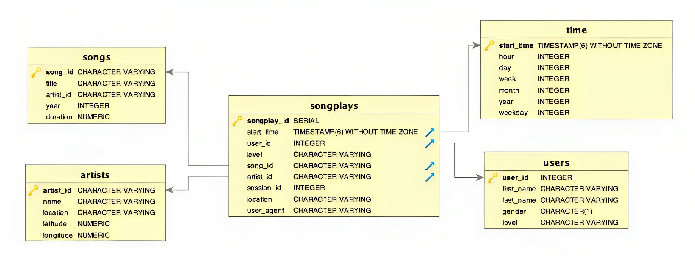

#  Building Data Pipelines with Airflow, AWS S3 and Redshift

### Introduction

Sparkify, a music streaming company, is embarking on a project to enhance their data warehouse ETL pipelines by introducing automation, monitoring, and data quality checks. They have identified Apache Airflow as the ideal tool for achieving these objectives. The source data resides in S3 and includes JSON logs detailing user activity in the application and JSON metadata about the songs users listen to.
***
### Aim
The primary objective is to build a data pipeline that ingests data from S3 to Redshift on an hourly basis.
***
### Technologies 

- **[Airflow](https://airflow.apache.org/)**: Apache Airflow is used to programmatically author, schedule, and monitor workflows. It allows for the creation of workflows as directed acyclic graphs (DAGs) of tasks, with a scheduler to execute tasks based on dependencies. Airflow provides a rich user interface for visualizing pipeline execution and monitoring progress.

- **[AWS S3](https://aws.amazon.com/s3/)**: S3 is used to store and protect data for various use cases. In this project, song and log data files are stored in public S3 buckets, with file paths specified in the `dwh.cfg` configuration file.

- **[AWS Redshift](https://aws.amazon.com/redshift/)**: Amazon Redshift is a fast, scalable data warehouse designed for analyzing data across data warehouses and data lakes. In this project, Redshift is used to create two staging tables, one fact table, and four dimension tables to efficiently organize and store data.
***
### Database & Pipeline
The Song and Log datasets are stored in AWS S3. A star schema has been created, consisting of one fact table: **songplays**, and four dimension tables: **users**, **songs**, **artists**, and **time**. Initially, Song data and Log data are ingested into two stage tables. Subsequently, another pipeline is built to transfer data from the stage tables to the five tables mentioned above.

The schema is displayed below:

